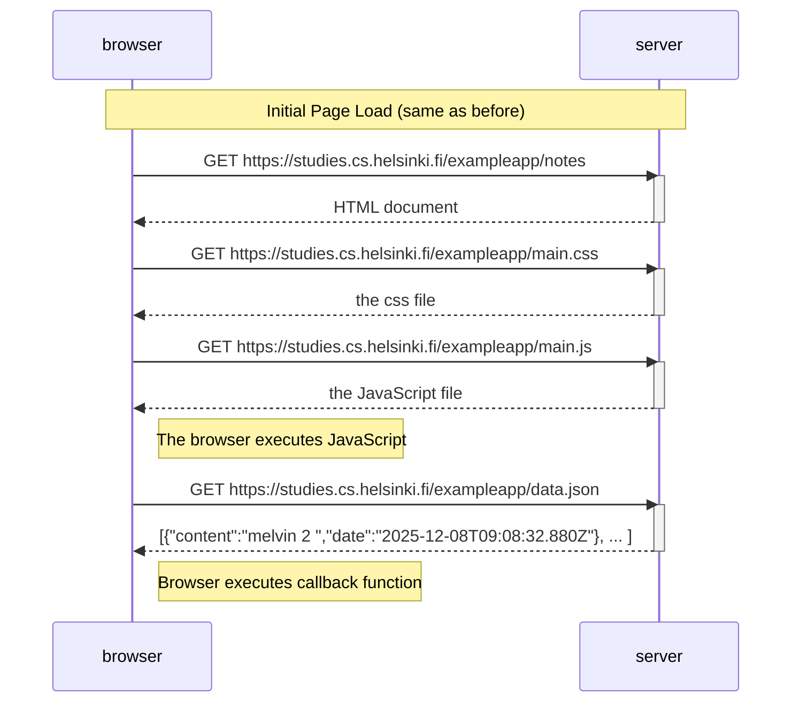

```mermaid
sequenceDiagram
    participant browser
    participant server

    Note over browser,server: Initial Page Load (same as before)
    
    browser->>server: GET https://studies.cs.helsinki.fi/exampleapp/notes
    activate server
    server-->>browser: HTML document
    deactivate server
    
    browser->>server: GET https://studies.cs.helsinki.fi/exampleapp/main.css
    activate server
    server-->>browser: the css file
    deactivate server
    
    browser->>server: GET https://studies.cs.helsinki.fi/exampleapp/main.js
    activate server
    server-->>browser: the JavaScript file
    deactivate server
    
    Note right of browser: The browser executes JavaScript
    
    browser->>server: GET https://studies.cs.helsinki.fi/exampleapp/data.json
    activate server
    server-->>browser: [{"content":"melvin 2 ","date":"2025-12-08T09:08:32.880Z"}, ... ]
    deactivate server
    
    Note right of browser: Browser executes callback function 
```